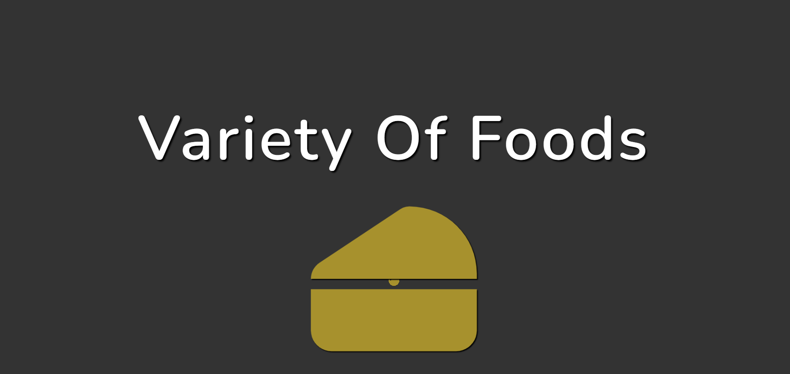
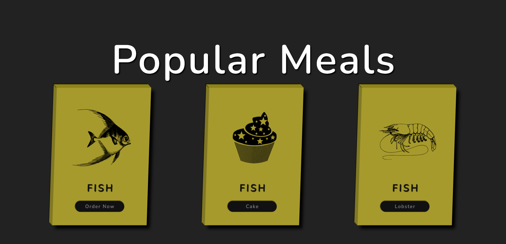

# Food Selling Website

Welcome to the Food Selling Website project! 




## Table of Contents

- [Introduction](#introduction)
- [Features](#features)
- [Getting Started](#getting-started)
  - [Prerequisites](#prerequisites)
  - [Installation](#installation)
- [Usage](#usage)
- [Contact](#contact)

## Introduction

This is a personal learning project aims to create a user-friendly and visually appealing food selling website using HTML, CSS, and JavaScript. It consists of several sections, including a cool landing page with a slideshow, a card section, a gallery with interactive dish details, and a footer with input fields.


## Features

- Landing page .
- Cart section .
- Interactive gallery with dish details .
- Footer .

## Getting Started

Follow these steps to set up and run the project locally.

### Prerequisites

- Web browser (e.g., Chrome, Firefox)
- Code editor (e.g., Visual Studio Code)
- Optional: [VS Code Extension(Live Server)](https://marketplace.visualstudio.com/items?itemName=ritwickdey.LiveServer)

### Installation

1. Clone this repository to your local machine:

   ```bash
   git clone https://github.com/your-username/food-selling-website.git

## Usage

To experience the website's functionality, follow these steps:

1. Open the project folder in your preferred code editor (e.g., Visual Studio Code).

2. Launch the website using the VS Code Live Server extension (if installed).
Click on Go Live from the status bar to turn the server on/off or Right-click on the `index.html` file and select "Open with Live Server." This will open the website in your default web browser.

3. Explore the website.


## Contact

If you have any questions, suggestions, or feedback, please feel free to contact me at baisudarshankumar@gmail.com .
